# Sensor Net User Guide

**A Wireless Mesh Sensor Network with LoRa Radio, ESP32, and a Live Monitoring Dashboard**

---

## Links and Resources

### Documentation Website

- **Sensor Net Documentation:** <https://sensor-net.aglemons.com/>

### GitHub Repositories

| Repository          | Description                    | Link                                                  |
| ------------------- | ------------------------------ | ----------------------------------------------------- |
| sensor-net-firmware | Firmware for the nodes         | <https://github.com/AndrewLemons/sensor-net-firmware> |
| sensor-net-monitor  | Desktop monitoring application | <https://github.com/AndrewLemons/sensor-net-monitor>  |
| sensor-net-docs     | Documentation website source   | <https://github.com/AndrewLemons/sensor-net-docs>     |

## Project Overview

Sensor Net is a small-scale wireless sensor network you can build with off-the-shelf hardware costing roughly $30 per node. Sensor nodes read temperature and atmospheric pressure from attached sensors, broadcast readings over long-range LoRa radio, and relay each other's packets through a simple mesh network. A receiver node collects all the data and forwards it to a desktop monitoring application that provides live analytics and visualization.

The system demonstrates the five stages of a data pipeline:

| Stage         | How Sensor Net Implements It                                                        |
| ------------- | ----------------------------------------------------------------------------------- |
| **Capture**   | Sensor nodes read physical measurements from the environment using I2C sensors      |
| **Represent** | Readings are encoded into compact Protocol Buffer messages with metadata            |
| **Transmit**  | Data is broadcast over LoRa radio through a multi-hop mesh network                  |
| **Transform** | The monitor application computes trends, anomalies, and health scores from raw data |
| **Present**   | A live dashboard displays charts, node maps, and derived insights                   |

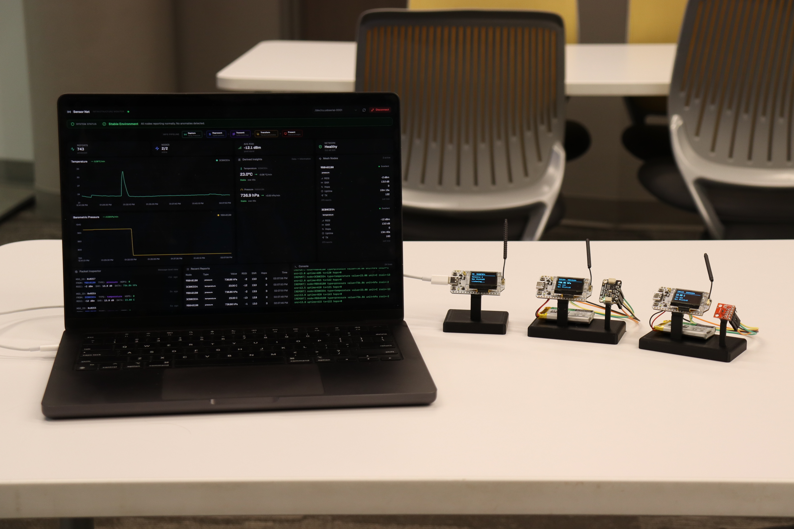

---

## Part 1: Parts and Materials

### Per-Node Components

Every node uses the same development board. You need at least **three boards** for a minimal network (one receiver, one temperature sensor, one pressure sensor).

| Component              | Qty        | Approx. Cost | Notes                                                     |
| ---------------------- | ---------- | ------------ | --------------------------------------------------------- |
| Heltec WiFi LoRa 32 V3 | 1 per node | ~$18 USD     | ESP32-S3 with built-in SX1262 LoRa radio and OLED display |


### Sensor Breakout Boards

Each sensor node needs one breakout board. The receiver node does not need any external sensor.

| Component             | Used By          | Approx. Cost | Notes                                           |
| --------------------- | ---------------- | ------------ | ----------------------------------------------- |
| TMP102 breakout board | Temperature node | ~$5 USD      | Texas Instruments 12-bit I2C temperature sensor |
| BMP280 breakout board | Pressure node    | ~$4 USD      | Bosch digital barometric pressure sensor        |

Popular sources include SparkFun, Adafruit, and various vendors on Amazon. Any generic TMP102 or BMP280 breakout with standard I2C header pins will work.

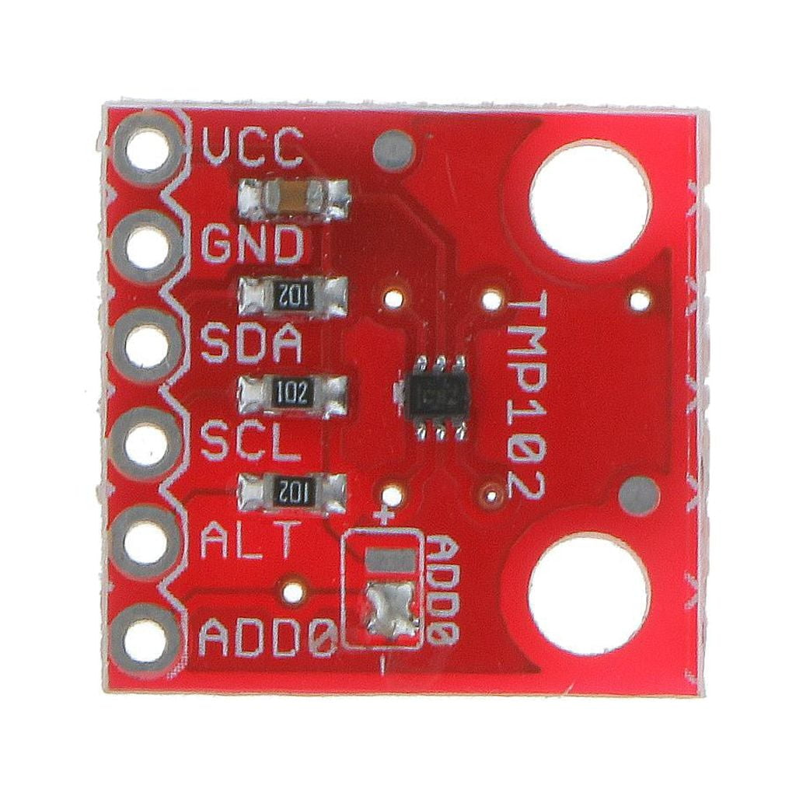

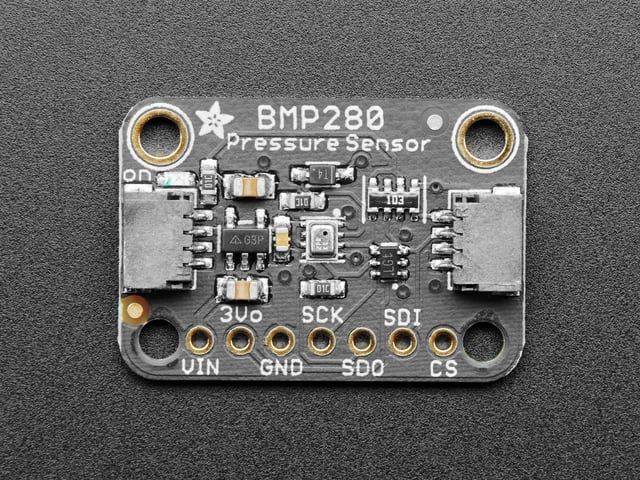

### Wiring Supplies

| Component                                     | Quantity          | Notes                                           |
| --------------------------------------------- | ----------------- | ----------------------------------------------- |
| Breadboard (optional)                         | 1 per sensor node | A small 170-point mini breadboard is sufficient |
| Jumper wires (male-to-male or male-to-female) | 4 per sensor node | For VCC, GND, SDA, and SCL connections          |

### Minimum Network Cost Summary

| Item                   | Quantity | Total Cost |
| ---------------------- | -------- | ---------- |
| Heltec WiFi LoRa 32 V3 | 3        | ~$54       |
| TMP102 breakout        | 1        | ~$5        |
| BMP280 breakout        | 1        | ~$4        |
| Jumper wires           | 8        | ~$3        |
| **Total**              |          | **~$66**   |

### Optional Extras

| Item                                  | Purpose                                           |
| ------------------------------------- | ------------------------------------------------- |
| USB battery bank or LiPo battery      | Power sensor nodes without a laptop connection    |
| 3D printed enclosure                  | Protect boards and sensors for outdoor deployment |
| Additional Heltec boards              | Add more nodes to test mesh relay behavior        |
| Additional TMP102 or BMP280 breakouts | Build multiple nodes of the same type             |

---

## Part 2: Software Prerequisites

Install all of the following tools before proceeding. The firmware and monitor application have separate requirements.

### For the Firmware

#### PlatformIO

PlatformIO manages compilers, board support packages, and library dependencies for the ESP32 firmware.

**Option A — VS Code Extension (recommended):**

1. Install Visual Studio Code from <https://code.visualstudio.com/>.
2. Open the Extensions panel (`Ctrl+Shift+X` / `Cmd+Shift+X`).
3. Search for **PlatformIO IDE** and click **Install**.
4. Restart VS Code when prompted.

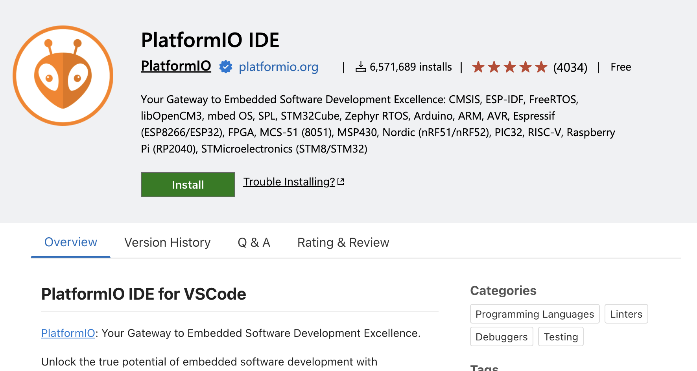

**Option B — Command-line:**

```sh
pip install platformio
```

Verify:

```sh
pio --version
```

#### Git

Check if Git is already installed:

```sh
git --version
```

If not installed:

- **macOS:** `xcode-select --install`
- **Windows:** Download from <https://git-scm.com/>
- **Linux (Debian/Ubuntu):** `sudo apt install git`

### For the Monitor Application

#### Rust

```sh
curl --proto '=https' --tlsv1.2 -sSf https://sh.rustup.rs | sh
```

Restart your terminal, then verify:

```sh
rustc --version
```

On Windows, download and run the installer from <https://rustup.rs/>.

#### Bun

```sh
curl -fsSL https://bun.sh/install | bash
```

Verify:

```sh
bun --version
```

On Windows:

```powershell
powershell -c "irm bun.sh/install.ps1|iex"
```

#### Tauri System Dependencies

**macOS:**

```sh
xcode-select --install
```

**Linux (Debian/Ubuntu):**

```sh
sudo apt update
sudo apt install libwebkit2gtk-4.1-dev build-essential curl wget file \
  libxdo-dev libssl-dev libayatana-appindicator3-dev librsvg2-dev
```

**Windows:**

Install the Microsoft C++ Build Tools from <https://visualstudio.microsoft.com/visual-cpp-build-tools/> and select the "Desktop development with C++" workload.

For full platform-specific instructions, see the Tauri prerequisites guide: <https://tauri.app/start/prerequisites/>.

### Verification Checklist

| Tool                                | Needed For  | Verify With         |
| ----------------------------------- | ----------- | ------------------- |
| VS Code + PlatformIO (or `pio` CLI) | Firmware    | `pio --version`     |
| Git                                 | Both        | `git --version`     |
| Rust (`rustc`, `cargo`)             | Monitor app | `rustc --version`   |
| Bun                                 | Monitor app | `bun --version`     |
| Tauri system dependencies           | Monitor app | (platform-specific) |

---

## Part 3: Understanding the Hardware

### The Heltec WiFi LoRa 32 V3

Every node uses this all-in-one development board which combines a microcontroller, LoRa radio, and OLED display on a single PCB.


**What is on the board:**

| Component       | Chip     | Description                                            |
| --------------- | -------- | ------------------------------------------------------ |
| Microcontroller | ESP32-S3 | Dual-core 240 MHz processor, 512 KB SRAM, 8 MB flash   |
| LoRa radio      | SX1262   | Semtech long-range radio, connected internally via SPI |
| Display         | SSD1306  | 128x64 pixel OLED, connected internally via I2C        |
| Power           | —        | LiPo battery connector with charging circuit           |
| Interface       | USB-C    | For programming, serial monitoring, and power          |

**Key specifications:**

| Specification        | Value                        |
| -------------------- | ---------------------------- |
| Processor            | ESP32-S3, dual-core 240 MHz  |
| LoRa chip            | SX1262                       |
| LoRa frequency range | 863–928 MHz                  |
| Display              | SSD1306 128x64 OLED          |
| USB                  | USB-C (programming + serial) |
| Dimensions           | Approximately 50 x 26 mm     |

### The Shared I2C Bus

The board's I2C bus (SDA on GPIO 17, SCL on GPIO 18) is shared between the onboard OLED and any external sensors. Each device has a unique address:

| Device       | I2C Address | Purpose                       |
| ------------ | ----------- | ----------------------------- |
| SSD1306 OLED | 0x3C        | Onboard display               |
| TMP102       | 0x48        | Temperature sensor (external) |
| BMP280       | 0x76        | Pressure sensor (external)    |

### The Vext Power Rail

The Heltec board has a **Vext** power circuit that controls power to external peripherals, including the OLED display. Vext is activated by driving **GPIO 36 LOW** (active-low logic). The firmware handles this at startup. If the OLED display does not turn on, this is the first thing to check.

### TMP102 Temperature Sensor

| Property            | Value              |
| ------------------- | ------------------ |
| Interface           | I2C                |
| Default I2C address | 0x48 (ADD0 → GND)  |
| Resolution          | 0.0625 °C (12-bit) |
| Accuracy            | ±0.5 °C (typical)  |
| Range               | −40 °C to +125 °C  |
| Supply voltage      | 1.4V to 3.6V       |

### BMP280 Pressure Sensor

| Property            | Value            |
| ------------------- | ---------------- |
| Interface           | I2C              |
| Default I2C address | 0x76 (SDO → GND) |
| Pressure range      | 300 to 1100 hPa  |
| Pressure resolution | 0.16 Pa          |
| Accuracy            | ±1 hPa (typical) |
| Supply voltage      | 1.71V to 3.6V    |

---

## Part 4: Hardware Assembly

Gather the following for each sensor node before starting:

- 1 Heltec WiFi LoRa 32 V3 board
- 1 sensor breakout board (TMP102 or BMP280)
- 4 jumper wires
- Battery (optional)

Make sure the Heltec board is **not connected to USB power** while wiring.

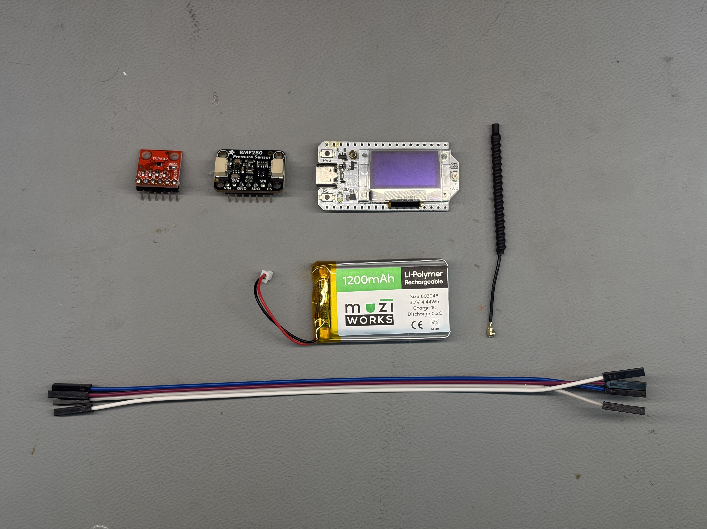

### Step 1: Receiver Node

The receiver node uses **only** the Heltec board with no external wiring. Simply plug it into your computer with a USB-C cable. It does not need any sensors — its sole job is to listen for incoming LoRa packets and forward them to the computer.

### Step 2: Temperature Node (TMP102)

The TMP102 connects to the Heltec board's I2C bus using four wires.

**Pin connections:**

| TMP102 Pin | Heltec V3 Pin | Purpose                  |
| ---------- | ------------- | ------------------------ |
| VCC        | 3.3V          | Power supply             |
| GND        | GND           | Ground                   |
| SDA        | GPIO 17       | I2C data line            |
| SCL        | GPIO 18       | I2C clock line           |
| ADD0       | GND           | Sets I2C address to 0x48 |

**Assembly steps:**

1. Solder appropriate headers on both boards.
2. Connect a jumper wire from the TMP102 **VCC** pin to the Heltec **3.3V** pin.
3. Connect a jumper wire from the TMP102 **GND** pin to the Heltec **GND** pin.
4. Connect a jumper wire from the TMP102 **SDA** pin to Heltec **GPIO 17**.
5. Connect a jumper wire from the TMP102 **SCL** pin to Heltec **GPIO 18**.

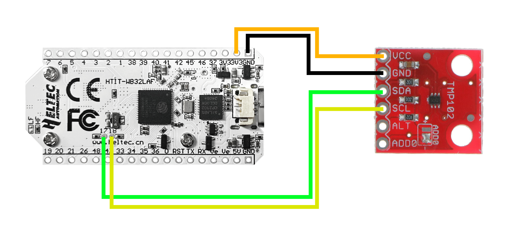

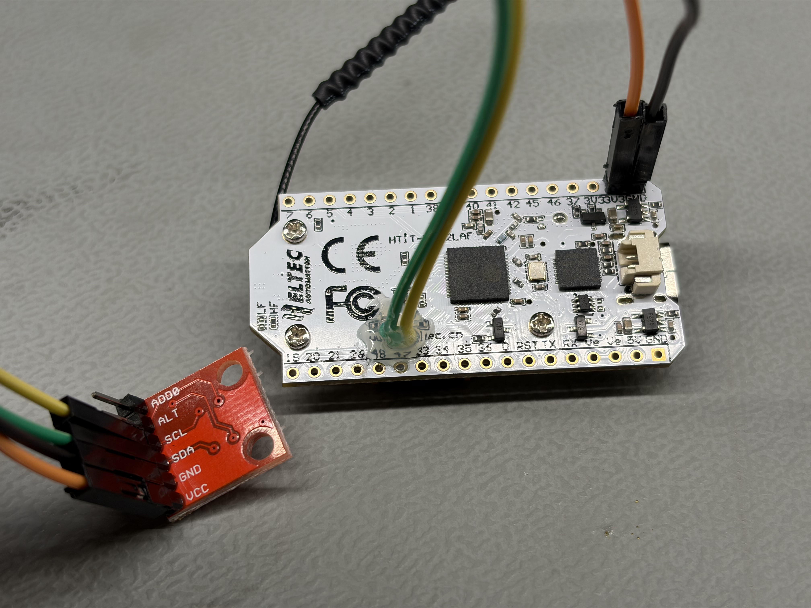

> **WARNING:** Always connect VCC to the **3.3V** pin, not the 5V pin. The TMP102 is a 3.3V device and can be damaged by 5V.

### Step 3: Pressure Node (BMP280)

The BMP280 also connects over I2C with the same four data wires.

**Pin connections:**

| BMP280 Pin | Heltec V3 Pin | Purpose                  |
| ---------- | ------------- | ------------------------ |
| VIN        | 3.3V          | Power supply             |
| GND        | GND           | Ground                   |
| SDA        | GPIO 17       | I2C data line            |
| SCL        | GPIO 18       | I2C clock line           |
| SDO        | GND           | Sets I2C address to 0x76 |

**Assembly steps:**

1. Solder appropriate headers on both boards.
2. Connect a jumper wire from the BMP280 **VIN** pin to the Heltec **3.3V** pin.
3. Connect a jumper wire from the BMP280 **GND** pin to the Heltec **GND** pin.
4. Connect a jumper wire from the BMP280 **SDA** pin to Heltec **GPIO 17**.
5. Connect a jumper wire from the BMP280 **SCL** pin to Heltec **GPIO 18**.

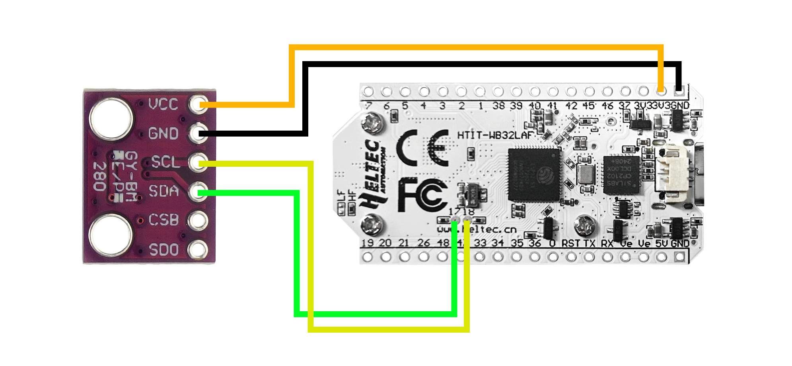

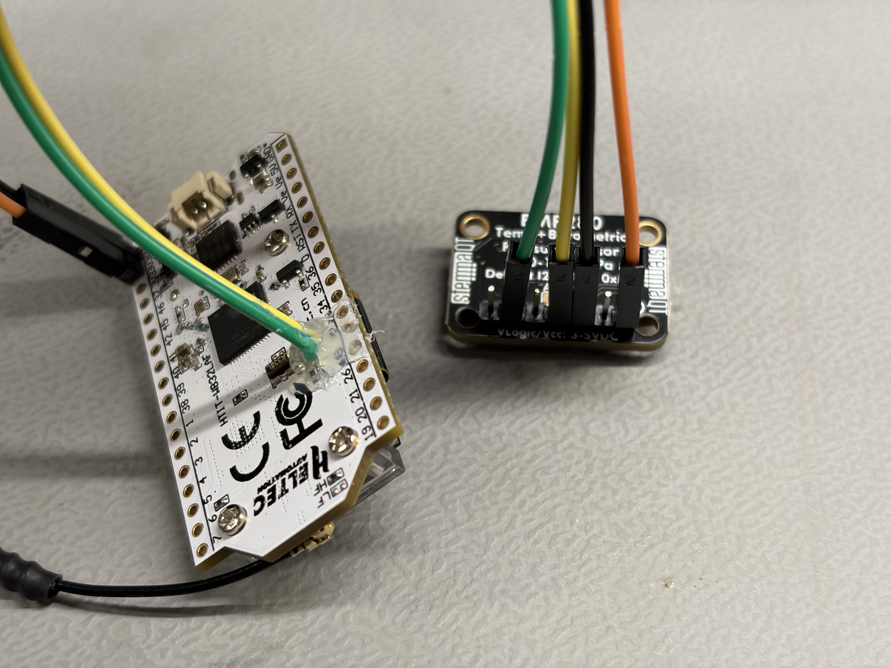

> **NOTE:** Some BMP280 breakout boards label the power pin as **VCC** instead of **VIN**. Some may also have a **CSB** pin — leave it unconnected or tie it to VCC to select I2C mode.

### Step 4: Connect Batteries (Optional)

If you want wireless sensor nodes, connect a LiPo battery to the JST connector on the Heltec board. The board has a built-in charging circuit. It is recommended to only battery-power the sensor nodes, since the receiver needs USB for computer communication.

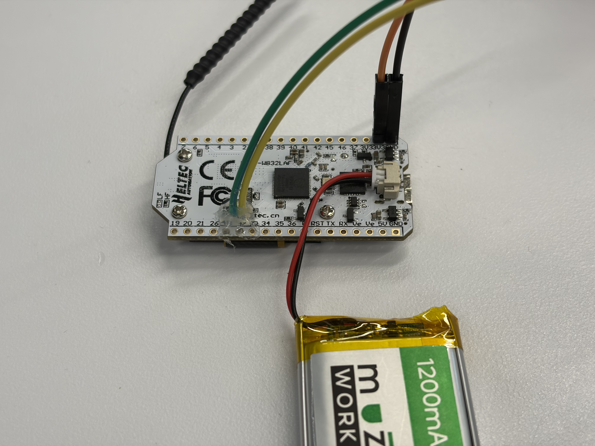

### Verifying Your Wiring

After assembly, connect each board via USB. Use the PlatformIO serial monitor or an I2C scanner sketch to verify that sensors respond at the expected address:

| Device                 | Expected Address |
| ---------------------- | ---------------- |
| SSD1306 OLED (onboard) | 0x3C             |
| TMP102 (if attached)   | 0x48             |
| BMP280 (if attached)   | 0x76             |

If the sensor does not appear, double-check that SDA and SCL are not swapped, and that the address-select pin (ADD0 or SDO) is connected to GND.

### Assembly Tips

- **Keep wires short.** Shorter I2C wires are more reliable.
- **Secure the breadboard.** The Heltec board can wiggle loose during handling.
- **Label your nodes.** Put a small sticker on each board indicating its role (Receiver, Temperature, Pressure).
- **I2C pins are on the back.** They can't have pin headers soldered easily. Strip the end of two jumper cables and solder directly to the pads.


---

## Part 5: Firmware Setup, Configuration, and Flashing

### Step 1: Clone the Firmware Repository

```sh
git clone https://github.com/AndrewLemons/sensor-net-firmware.git
cd sensor-net-firmware
```

Open the folder in VS Code. PlatformIO will automatically detect the project and download the ESP32 board support package.

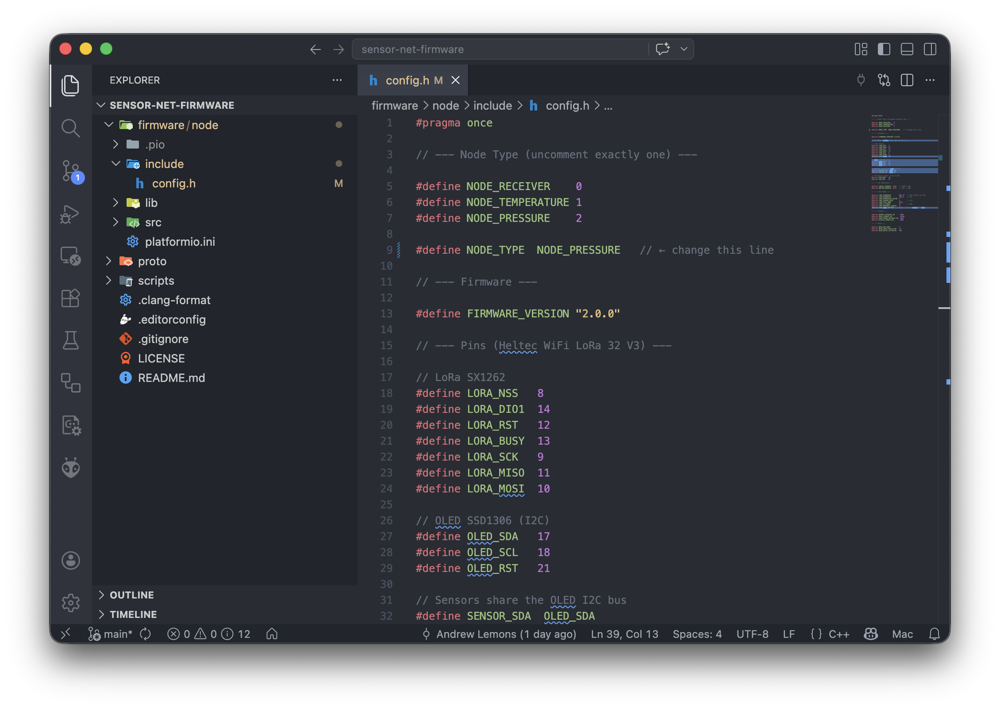

### Step 2: Verify the Toolchain

Compile without flashing to confirm everything is installed:

```sh
cd firmware/node
pio run
```

A successful build ends with `SUCCESS`. If you see errors about missing libraries, run `pio pkg update`.

### Step 3: Understand the Project Layout

```
sensor-net-firmware/
  proto/
    messages.proto          # Protobuf message definitions
    messages.options        # Nanopb options (max string lengths)
  scripts/
    generate_proto.sh       # Regenerate C bindings from .proto
  firmware/node/
    platformio.ini          # Board, framework, and library configuration
    include/
      config.h              # All build-time settings (node type, radio, timing)
    src/
      main.cpp              # Firmware entry point (setup and loop)
    lib/
      proto/                # Generated protobuf C code
      RadioManager/         # LoRa radio abstraction
      MeshRouter/           # Mesh relay logic
      PeerTracker/          # Active peer tracking (receiver only)
      DisplayManager/       # OLED display driver
      Sensor/               # Sensor interface and drivers (TMP102, BMP280)
```

### Step 4: Configure Each Node

All configuration lives in `firmware/node/include/config.h`. The most important setting is `NODE_TYPE`:

```c
#define NODE_TYPE  NODE_RECEIVER      // 0 - Listen and forward to serial
// #define NODE_TYPE  NODE_TEMPERATURE // 1 - Read TMP102, transmit, relay
// #define NODE_TYPE  NODE_PRESSURE    // 2 - Read BMP280, transmit, relay
```

Uncomment the line for the role you want and comment out the others. You must rebuild and reflash every time you change this.

**Radio settings** (all nodes must match):

| Setting                 | Default  | Description                                      |
| ----------------------- | -------- | ------------------------------------------------ |
| `LORA_FREQUENCY`        | `902.25` | Frequency in MHz (902.25 for US, 868.0 for EU)   |
| `LORA_BANDWIDTH`        | `500.0`  | Bandwidth in kHz                                 |
| `LORA_SPREADING_FACTOR` | `7`      | Range: 7–12. Higher = longer range, slower       |
| `LORA_CODING_RATE`      | `5`      | Error correction (4/x). Higher = more redundancy |
| `LORA_SYNC_WORD`        | `0x34`   | Network identifier                               |
| `LORA_TX_POWER`         | `21`     | Transmit power in dBm                            |

**Timing settings:**

| Setting              | Default | Description                              |
| -------------------- | ------- | ---------------------------------------- |
| `REPORT_INTERVAL_MS` | `5000`  | Milliseconds between sensor readings     |
| `PEER_TIMEOUT_MS`    | `15000` | Receiver drops a node after this silence |
| `DISPLAY_UPDATE_MS`  | `1000`  | OLED refresh interval                    |

**Mesh settings:**

| Setting                | Default | Description               |
| ---------------------- | ------- | ------------------------- |
| `MESH_MAX_HOPS`        | `3`     | Max relay hops (TTL)      |
| `MESH_SEEN_TABLE_SIZE` | `32`    | Deduplication buffer size |
| `MESH_RELAY_JITTER_MS` | `200`   | Random delay before relay |

> **IMPORTANT:** If you change any radio parameter on one node, you must change it on **every** node. Mismatched settings prevent communication.

### Step 5: Flash the Receiver Node

1. Set `NODE_TYPE` to `NODE_RECEIVER` in `config.h`.
2. Connect the first Heltec board via USB-C.
3. Build and flash:

```sh
cd firmware/node
pio run -t upload
```

4. Verify with the serial monitor:

```sh
pio device monitor
```

Expected output:

```
=== LoRa Receiver Node AABBCCDD ===
Firmware 2.0.0  |  Mesh max-hops=3
[RADIO] SX1262 ready
```


### Step 6: Flash the Temperature Node

1. Change `NODE_TYPE` to `NODE_TEMPERATURE` in `config.h`.
2. Connect the second Heltec board (with TMP102 wired) via USB-C.
3. Build and flash:

```sh
pio run -t upload
```

4. Verify serial output shows:

```
=== LoRa Temperature Node AABBCCDD ===
[RADIO] SX1262 ready
[SENSOR] TMP102 ready
[TX] TMP102=23.45 C  #1 (22 bytes)
```

### Step 7: Flash the Pressure Node

1. Change `NODE_TYPE` to `NODE_PRESSURE` in `config.h`.
2. Connect the third Heltec board (with BMP280 wired) via USB-C.
3. Build and flash:

```sh
pio run -t upload
```

4. Verify serial output shows pressure readings.

### Step 8: Power On and Test the Network

1. Power all three boards (via USB or battery).
2. Connect the receiver board to your computer via USB.
3. Open the serial monitor for the receiver:

```sh
pio device monitor
```

4. Within a few seconds, `[REPORT]` lines should appear from both sensor nodes:

```
[REPORT] node=11223344 type=temperature value=23.45 unit=C rssi=-45 snr=8.5 uptime=120 tx=15 hops=0
[REPORT] node=55667788 type=pressure value=1013.25 unit=hPa rssi=-62 snr=5.2 uptime=300 tx=60 hops=1
```

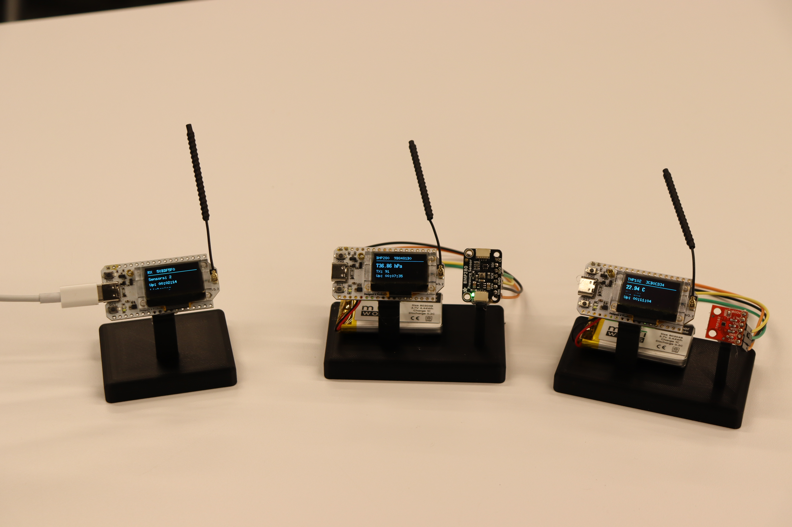

### Flashing Troubleshooting

| Problem                          | Solution                                                          |
| -------------------------------- | ----------------------------------------------------------------- |
| Build fails with missing library | Run `pio pkg update`                                              |
| Upload fails, cannot detect port | Check USB cable (some are charge-only). Try `pio device list`.    |
| OLED does not turn on            | Ensure `PIN_VEXT` (GPIO 36) is OUTPUT and driven LOW              |
| Sensor not detected              | Verify SDA→GPIO 17, SCL→GPIO 18. Check I2C address in `config.h`. |
| No reports on receiver           | Confirm all nodes use the same radio settings                     |

> **TIP:** If the upload fails with a port detection error, specify the port manually:
>
> ```sh
> pio run -t upload --upload-port /dev/tty.usbmodemXXXX
> ```

---

## Part 6: Monitor Application Setup

### Step 1: Clone the Repository

```sh
git clone https://github.com/AndrewLemons/sensor-net-monitor.git
cd sensor-net-monitor
```

### Step 2: Install Dependencies

```sh
bun install
```

This installs all frontend packages. Rust backend dependencies are downloaded automatically on first build.

### Step 3: Understand the Project Layout

```
sensor-net-monitor/
  src/                          # React/TypeScript frontend
    App.tsx                     # Root component
    main.tsx                    # Entry point
    analytics/                  # Pure analytics functions
    components/                 # React UI components
      SerialConnect.tsx         # Port selection toolbar
      SystemStatusBanner.tsx    # Overall health banner
      InformationPipeline.tsx   # Data pipeline visualization
      StatsCards.tsx            # Summary metric cards
      SensorChart.tsx           # Line charts for sensor data
      DerivedInsights.tsx       # Trend and anomaly display
      NetworkMap.tsx            # Mesh topology visualization
      NodeCards.tsx             # Per-node status cards
      PacketInspector.tsx       # Packet table
      ReportTable.tsx           # Raw report table
      LogConsole.tsx            # Serial log display
    hooks/
      useSerial.ts              # Serial connection state
      useMonitorData.ts         # Database data fetching
  src-tauri/                    # Rust/Tauri backend
    src/
      lib.rs                    # All backend logic
    Cargo.toml                  # Rust dependencies
  package.json
```

### Step 4: Run in Development Mode

```sh
bun run tauri dev
```

This starts both the Vite dev server (React frontend with hot reload) and the Tauri native wrapper. The first Rust compilation downloads and builds all dependencies — this may take several minutes.

### Step 5: Connect to the Receiver

1. Plug the receiver node into your computer via USB.
2. In the top toolbar, click the **refresh button** (circular arrow) to scan for available serial ports.
3. Select the receiver's port (e.g., `/dev/tty.usbmodemXXXX` on macOS, `COM3` on Windows).
4. Click **Connect** — the baud rate is fixed at 115200.
5. The status indicator in the header turns green when data is flowing.


Power on all sensor nodes. Within a few seconds you should see live temperature and pressure readings appear on the dashboard.


### Building for Distribution

To compile a production binary:

```sh
bun run tauri build
```

Output is placed in `src-tauri/target/release/bundle/`:

| OS      | Output Format              |
| ------- | -------------------------- |
| macOS   | `.dmg` installer           |
| Windows | `.msi` or `.exe` installer |
| Linux   | `.deb` or `.AppImage`      |

---

## Part 7: Using the Dashboard

Once connected and receiving data, the dashboard populates automatically. Here is what each section shows:

### System Status Banner

The colored bar at the top summarizes overall network health:

| Color | Meaning                                          |
| ----- | ------------------------------------------------ |
| Green | All nodes online, readings within normal ranges  |
| Amber | A node may be stale or signal quality is weak    |
| Red   | A node is offline or a sensor threshold exceeded |

### Information Pipeline

A visual strip showing the five data pipeline stages (Capture → Represent → Transmit → Transform → Present). Stages illuminate as data flows through the system.


### Stats Cards

| Card           | Description                            |
| -------------- | -------------------------------------- |
| Total Reports  | Total sensor reports received          |
| Nodes Online   | Distinct sensor nodes heard recently   |
| Average RSSI   | Average signal strength across packets |
| Network Health | Composite health score                 |

### Sensor Charts

Two line charts display temperature and pressure readings over time, with one line per node. Trend badges indicate rising, falling, or stable readings.

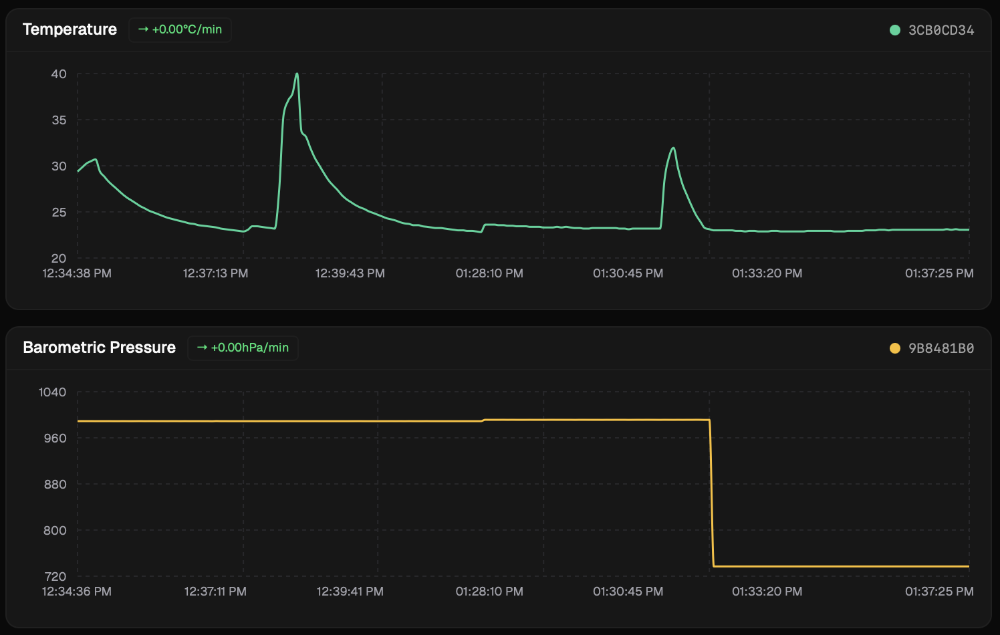

### Derived Insights

Shows current reading, trend direction, rate of change, and anomaly flags (e.g., overheating, rapid pressure drops) for each sensor.

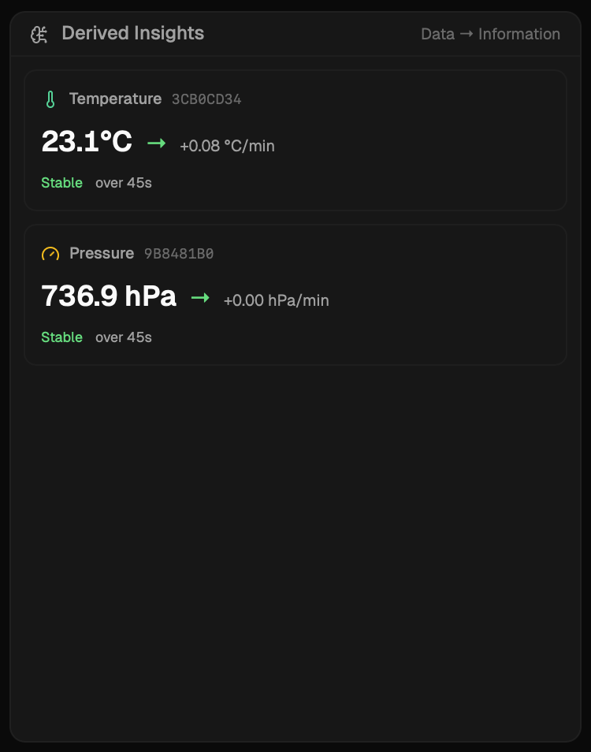

### Packet Inspector

A table showing the last 20 received packets with message ID, source node, sensor type, hops, RSSI, SNR, and value.

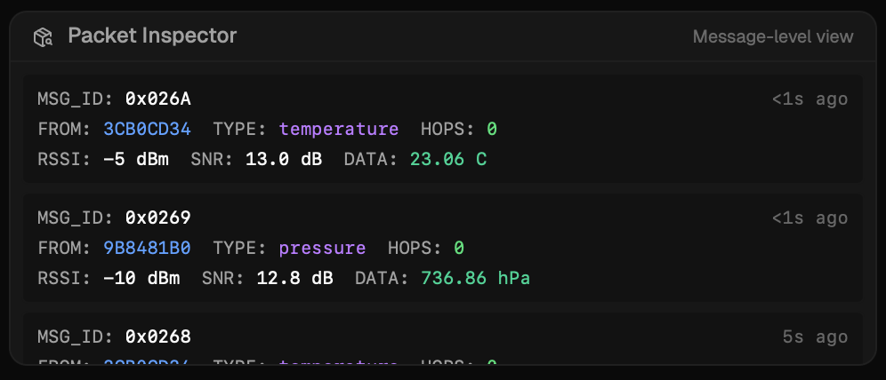

### Log Console

Raw serial output from the receiver node. Lines with valid `[REPORT]` data are highlighted in green.

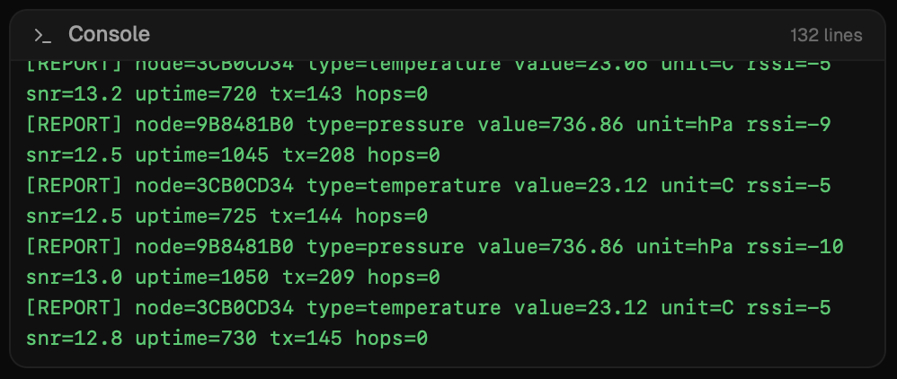

---

## Part 8: How It Works — Key Concepts

### LoRa Radio

LoRa (Long Range) uses **chirp spread spectrum** modulation to send data over long distances with high interference resistance. Key trade-offs:

| Spreading Factor | Approx. Data Rate (500 kHz BW) | Relative Range |
| ---------------- | ------------------------------ | -------------- |
| 7                | ~21.9 kbps                     | Baseline       |
| 10               | ~3.9 kbps                      | ~2x further    |
| 12               | ~1.2 kbps                      | ~3x further    |

LoRa radios are **half-duplex** — they can transmit or receive, but not both at once. This is why the receiver node never relays packets (it would miss incoming data).

### Mesh Networking

Sensor Net uses a **flooding mesh**: when a node receives a packet it hasn't seen before, it retransmits it. This extends coverage without a central router.

**Duplicate prevention:** Each node maintains a ring buffer of the last 32 message IDs. If a packet's `msg_id` has already been seen, it is silently dropped.

**Hop limit:** Each packet carries a `hops` field that increments at every relay. When it reaches `MESH_MAX_HOPS` (default: 3), the packet is dropped.

**Relay jitter:** Nodes wait a random delay (0–200 ms) before relaying to prevent simultaneous transmissions from colliding.

### Message Format (Protocol Buffers)

All data is encoded using Protocol Buffers (protobuf) via Nanopb for compact binary serialization. A typical packet is 22–30 bytes.

```protobuf
message SensorReport {
    uint32     node_id          = 1;
    uint32     uptime_s         = 2;
    uint32     tx_count         = 3;
    SensorType sensor_type      = 4;
    float      value            = 5;
    string     firmware_version = 6;
    uint32     msg_id           = 7;
    uint32     hops             = 8;
}
```

### Serial Output Format

The receiver prints one `[REPORT]` line per received packet:

```
[REPORT] node=11223344 type=temperature value=23.45 unit=C rssi=-45 snr=8.5 uptime=120 tx=15 hops=0
```

| Field    | Description                                     |
| -------- | ----------------------------------------------- |
| `node`   | Unique hex ID of the originating sensor node    |
| `type`   | `temperature` or `pressure`                     |
| `value`  | Numeric sensor reading                          |
| `unit`   | `C` (Celsius) or `hPa` (hectopascals)           |
| `rssi`   | Signal strength in dBm (closer to 0 = stronger) |
| `snr`    | Signal-to-noise ratio in dB (higher = cleaner)  |
| `uptime` | Seconds since the node last booted              |
| `tx`     | Total reports sent by the node                  |
| `hops`   | Mesh relay hops (0 = received directly)         |

### Understanding RSSI and SNR

| RSSI Range      | Signal Quality |
| --------------- | -------------- |
| −30 to −60 dBm  | Excellent      |
| −60 to −90 dBm  | Good           |
| −90 to −110 dBm | Fair           |
| Below −110 dBm  | Weak           |

| SNR Range   | Signal Quality |
| ----------- | -------------- |
| Above 5 dB  | Excellent      |
| 0 to 5 dB   | Good           |
| −5 to 0 dB  | Marginal       |
| Below −5 dB | Poor           |

---

## Part 9: Extending the Project

### Adding a New Sensor Type

1. Add the new type to `proto/messages.proto`:

```protobuf
enum SensorType {
    SENSOR_UNKNOWN     = 0;
    SENSOR_TEMPERATURE = 1;
    SENSOR_PRESSURE    = 2;
    SENSOR_HUMIDITY    = 3;  // New
}
```

2. Regenerate C bindings:

```sh
pip install nanopb
./scripts/generate_proto.sh
```

3. Create a sensor driver implementing the `Sensor` interface:

```cpp
class Sensor {
public:
    virtual bool          begin() = 0;
    virtual SensorReading read()  = 0;
    virtual const char   *name()  = 0;
    virtual const char   *unit()  = 0;
};
```

4. Add `NODE_HUMIDITY = 3` to `config.h`.
5. Wire it into `main.cpp` with a `#elif NODE_TYPE == NODE_HUMIDITY` block.
6. Update the receiver's serial format mapping for the new type.
7. Build and flash with `pio run -t upload`.

### Increasing Network Range

Adjust two radio parameters in `config.h` (on **all** nodes):

```c
#define LORA_SPREADING_FACTOR  10   // Was 7
#define LORA_BANDWIDTH         125.0 // Was 500.0
```

You can also increase `MESH_MAX_HOPS` for larger deployments.

### Modifying the Monitor Dashboard

- **New components:** Create files in `src/components/` and render them in `App.tsx`.
- **New analytics:** Extend the pure functions in `src/analytics/`.
- **New Rust commands:** Add functions with `#[tauri::command]` in `src-tauri/src/lib.rs`.
- **Alert thresholds:** Edit `src/analytics/thresholds.ts`.
