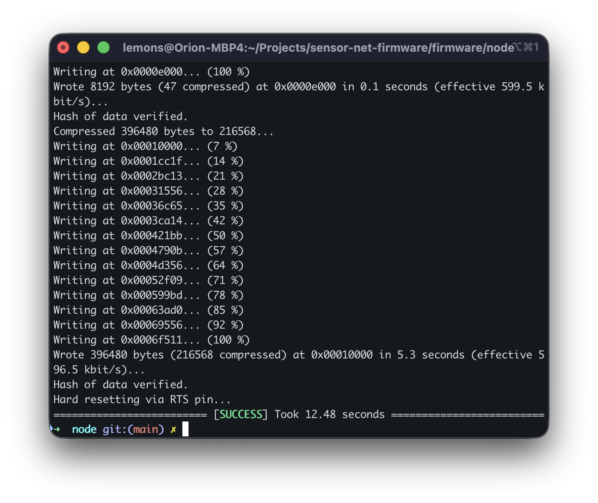
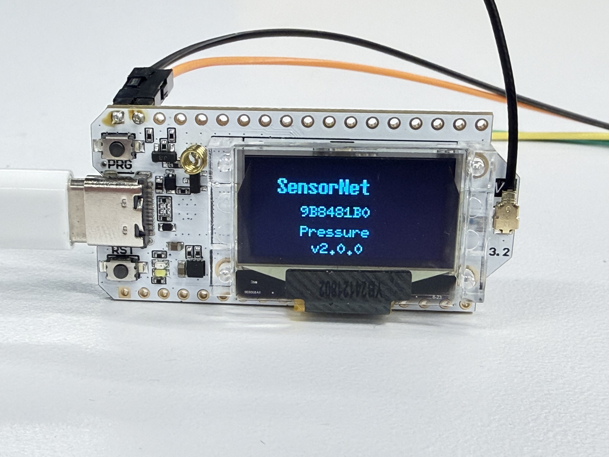

This page walks through building the firmware and flashing it to each Heltec board. You will repeat this process for each node in your network, changing the `NODE_TYPE` in `config.h` before each flash.

## Prerequisites Checklist

Before you begin, confirm:

- [ ] PlatformIO is installed (VS Code extension or CLI).
- [ ] The firmware repository is cloned and dependencies are downloaded (see [Firmware Setup](/firmware/setup/)).
- [ ] `config.h` is set to the desired `NODE_TYPE` (see [Configuration](/firmware/configuration/)).
- [ ] The Heltec board is connected to your computer via USB-C.

## Building the Firmware

Navigate to the firmware project directory and compile:

```sh
cd firmware/node
pio run
```

PlatformIO compiles the firmware for the ESP32-S3 target defined in `platformio.ini`. The first build is slower because the compiler toolchain and all libraries are compiled from source. Subsequent builds only recompile changed files.

If the build succeeds, you will see output ending with something like:

```
Building .pio/build/heltec_wifi_lora_32_V3/firmware.bin
============= [SUCCESS] Took X.XX seconds =============
```

If the build fails, check:

- Is `NODE_TYPE` set to a valid value (`NODE_RECEIVER`, `NODE_TEMPERATURE`, or `NODE_PRESSURE`)?
- Are all library dependencies downloaded? Try `pio pkg update`.

## Flashing to the Board

With the board connected via USB-C, upload the compiled firmware:

```sh
pio run -t upload
```

PlatformIO automatically detects the connected board's serial port, puts the ESP32 into bootloader mode, and flashes the firmware. You should see progress output followed by a success message.



:::tip
If the upload fails with a port detection error, you may need to specify the port manually:

```sh
pio run -t upload --upload-port /dev/tty.usbmodemXXXX
```

On Windows, use the COM port (e.g., `COM3`). You can list available ports with:

```sh
pio device list
```

:::

After flashing, the board automatically resets and begins running the new firmware. You should see the OLED display light up with a splash screen showing the node ID and role.



## Verifying with the Serial Monitor

To confirm the node is working, open the serial monitor:

```sh
pio device monitor
```

This connects at 115200 baud (the default for Sensor Net).

**Receiver node output:**

```
=== LoRa Receiver Node AABBCCDD ===
Firmware 2.0.0  |  Mesh max-hops=3

[RADIO] SX1262 ready
```

Once sensor nodes are powered on and in range, you will see `[REPORT]` lines appear.

**Sensor node output:**

```
=== LoRa Temperature Node AABBCCDD ===
[RADIO] SX1262 ready
[SENSOR] TMP102 ready
[TX] TMP102=23.45 C  #1 (22 bytes)
[TX] TMP102=23.50 C  #2 (22 bytes)
```

Press `Ctrl+C` to exit the serial monitor.

## Flashing a Complete Network

For a typical three-node network, follow this sequence:

### Step 1: Flash the Receiver

1. Open `config.h` and set `NODE_TYPE`:
   ```c
   #define NODE_TYPE  NODE_RECEIVER
   ```
2. Connect the first Heltec board via USB.
3. Build and flash:
   ```sh
   pio run -t upload
   ```
4. Verify with the serial monitor that the receiver boots correctly.
5. Disconnect this board (or leave it connected if you want to watch reports arrive).

### Step 2: Flash the Temperature Node

1. Open `config.h` and change `NODE_TYPE`:
   ```c
   #define NODE_TYPE  NODE_TEMPERATURE
   ```
2. Connect the second Heltec board (with TMP102 wired) via USB.
3. Build and flash:
   ```sh
   pio run -t upload
   ```
4. Verify that the serial monitor shows `[SENSOR] TMP102 ready` and `[TX]` lines.
5. Disconnect this board.

### Step 3: Flash the Pressure Node

1. Open `config.h` and change `NODE_TYPE`:
   ```c
   #define NODE_TYPE  NODE_PRESSURE
   ```
2. Connect the third Heltec board (with BMP280 wired) via USB.
3. Build and flash:
   ```sh
   pio run -t upload
   ```
4. Verify that the serial monitor shows pressure readings.

### Step 4: Power On and Test

1. Power all three boards (via USB or battery).
2. Connect the receiver board to your computer via USB.
3. Open the serial monitor for the receiver:
   ```sh
   pio device monitor
   ```
4. Within a few seconds, `[REPORT]` lines should appear from both the temperature and pressure nodes.

## Regenerating Protobuf Files

If you edit `proto/messages.proto` (for example, to add a new field), you need to regenerate the C bindings before rebuilding:

```sh
pip install nanopb
./scripts/generate_proto.sh
```

The generated files are placed in `firmware/node/lib/proto/`. You do not need to run this step unless you have modified the `.proto` file.

## Troubleshooting

| Problem                          | Solution                                                                                                           |
| -------------------------------- | ------------------------------------------------------------------------------------------------------------------ |
| Build fails with missing library | Run `pio pkg update` to download missing packages                                                                  |
| Upload fails, cannot detect port | Check USB cable (some cables are charge-only). Try a different port. Run `pio device list` to see available ports. |
| OLED does not turn on            | Ensure `PIN_VEXT` (GPIO 36) is set to OUTPUT and driven LOW in `config.h`                                          |
| Sensor not detected              | Verify wiring (SDA to GPIO 17, SCL to GPIO 18). Check I2C address matches `config.h`.                              |
| No reports on receiver           | Confirm all nodes use the same radio settings (frequency, bandwidth, SF, sync word).                               |

## Next Step

Learn how to interpret the serial output in [Serial Output](/firmware/serial-output/).
