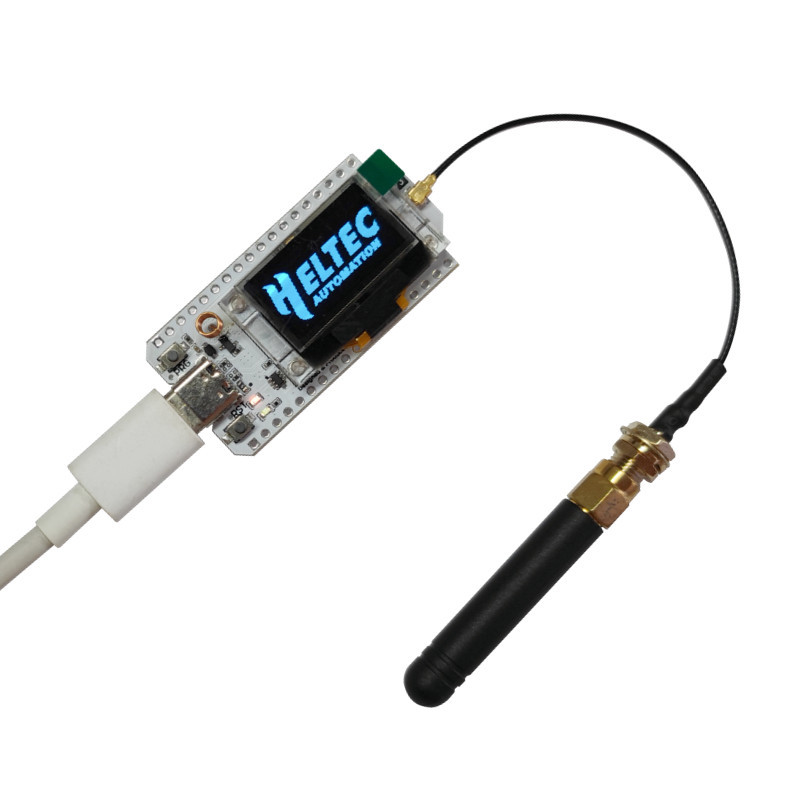

This page lists every component needed to build a complete Sensor Net network. A minimal network consists of three nodes: one receiver, one temperature sensor, and one pressure sensor. You can add more sensor nodes to extend coverage or add redundancy.

## Per-Node Components

Every node in the network uses the same development board. You need at least three boards for a minimal network.

| Component              | Quantity   | Approximate Cost | Notes                                                     |
| ---------------------- | ---------- | ---------------- | --------------------------------------------------------- |
| Heltec WiFi LoRa 32 V3 | 1 per node | ~$18 USD         | ESP32-S3 with built-in SX1262 LoRa radio and OLED display |

## Sensor Breakout Boards

Each sensor node needs one breakout board. The receiver node does not need any external sensor.

| Component             | Used By          | Approximate Cost | Notes                                           |
| --------------------- | ---------------- | ---------------- | ----------------------------------------------- |
| TMP102 breakout board | Temperature node | ~$5 USD          | Texas Instruments 12-bit I2C temperature sensor |
| BMP280 breakout board | Pressure node    | ~$4 USD          | Bosch digital barometric pressure sensor        |

Popular sources for these breakout boards include SparkFun, Adafruit, and various vendors on Amazon. Any generic TMP102 or BMP280 breakout with standard I2C header pins will work.

## Wiring Supplies

To connect the sensors to the Heltec board, you need a small amount of wiring supplies.

| Component                                     | Quantity          | Notes                                           |
| --------------------------------------------- | ----------------- | ----------------------------------------------- |
| Breadboard (optional)                         | 1 per sensor node | A small 170-point mini breadboard is sufficient |
| Jumper wires (male-to-male or male-to-female) | 4 per sensor node | For VCC, GND, SDA, and SCL connections          |

If you prefer a permanent installation, you can solder the connections directly instead of using a breadboard.

## Minimum Network Summary

For a three-node network (receiver + temperature + pressure):

| Item                   | Quantity | Total Cost |
| ---------------------- | -------- | ---------- |
| Heltec WiFi LoRa 32 V3 | 3        | ~$54       |
| TMP102 breakout        | 1        | ~$5        |
| BMP280 breakout        | 1        | ~$4        |
| Jumper wires           | 8        | ~$3        |
| **Total**              |          | **~$66**   |

Costs vary by supplier and region. The Heltec boards are the primary expense. The sensors and wiring supplies are inexpensive.

## Optional Extras

These are not required but can be useful:

| Item                                  | Purpose                                           |
| ------------------------------------- | ------------------------------------------------- |
| USB battery bank or LiPo battery      | Power sensor nodes without a laptop connection    |
| 3D printed enclosure                  | Protect boards and sensors for outdoor deployment |
| Additional Heltec boards              | Add more nodes to test mesh relay behavior        |
| Additional TMP102 or BMP280 breakouts | Build multiple nodes of the same type             |

## Next Step

Once you have your parts, head to [Software Prerequisites](/getting-started/software-prerequisites/) to install the tools you need on your computer.
