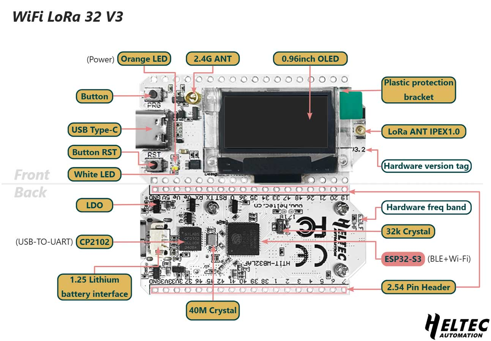

Every node in Sensor Net uses the **Heltec WiFi LoRa 32 V3**, an all-in-one development board that combines a microcontroller, LoRa radio, and OLED display on a single PCB. This page describes what is on the board and how Sensor Net uses it.



## What Is On the Board

The Heltec V3 bundles several components that would otherwise need to be purchased and wired separately:

| Component       | Chip     | Description                                                      |
| --------------- | -------- | ---------------------------------------------------------------- |
| Microcontroller | ESP32-S3 | Dual-core 240 MHz processor, 512 KB SRAM, 8 MB flash             |
| LoRa radio      | SX1262   | Semtech long-range radio, connected internally via SPI           |
| Display         | SSD1306  | 128x64 pixel OLED, connected internally via I2C                  |
| Clock           | TCXO     | Temperature-Compensated Crystal Oscillator for precise RF timing |
| Power           | --       | LiPo battery connector with charging circuit                     |
| Interface       | USB-C    | For programming, serial monitoring, and power                    |

Because the radio and display are already wired to the microcontroller on the PCB, you do not need to solder or breadboard those connections. The only external wiring required is for the sensor breakout boards.

## How Sensor Net Uses It

The firmware uses a subset of the board's capabilities:

- **ESP32-S3 in Arduino mode** -- The firmware runs as a single-core Arduino sketch. The built-in Wi-Fi and Bluetooth radios are not used.
- **SX1262 radio** -- Controlled through RadioLib over the internal SPI bus. Transmits and receives LoRa packets on the 902.25 MHz band (US).
- **SSD1306 OLED** -- Driven by the U8g2 library over the internal I2C bus. Displays node status, sensor readings, and uptime.
- **USB-C serial** -- Used for programming the board and for the receiver node to send structured data to a connected computer at 115200 baud.
- **Unique node ID** -- Each ESP32 has a factory-burned MAC address. The firmware reads this with `ESP.getEfuseMac()` and uses the lower 32 bits as the node's permanent identifier. No manual address assignment is needed.

## The Vext Power Rail

An important detail about this board: it has a **Vext** power circuit that controls power to external peripherals, including the OLED display. Vext is activated by driving **GPIO 36 LOW** (active-low logic). The firmware does this at startup:

```cpp
pinMode(PIN_VEXT, OUTPUT);
digitalWrite(PIN_VEXT, LOW);  // active LOW = enables 3.3V rail
```

If the OLED display does not turn on, this pin configuration is the first thing to check.

## The Shared I2C Bus

The board's I2C bus (SDA on GPIO 17, SCL on GPIO 18) is shared between the onboard OLED and any external sensors you connect. This works because I2C devices are addressed -- each device has a unique 7-bit address, similar to a house number on a street.

The three devices on the Sensor Net I2C bus:

| Device       | I2C Address | Purpose                       |
| ------------ | ----------- | ----------------------------- |
| SSD1306 OLED | 0x3C        | Onboard display               |
| TMP102       | 0x48        | Temperature sensor (external) |
| BMP280       | 0x76        | Pressure sensor (external)    |

Because the addresses are all different, all three coexist on the same pair of wires without interfering with each other.

## Key Specifications

| Specification        | Value                                |
| -------------------- | ------------------------------------ |
| Processor            | ESP32-S3, dual-core 240 MHz          |
| RAM                  | 512 KB SRAM                          |
| Flash                | 8 MB                                 |
| LoRa chip            | SX1262                               |
| LoRa frequency range | 863-928 MHz                          |
| Display              | SSD1306 128x64 OLED                  |
| USB                  | USB-C (programming + serial)         |
| Battery              | JST connector, LiPo charging circuit |
| Dimensions           | Approximately 50 x 26 mm             |

## Next Step

Learn about the external sensors in the [Sensors](/hardware/sensors/) page.
