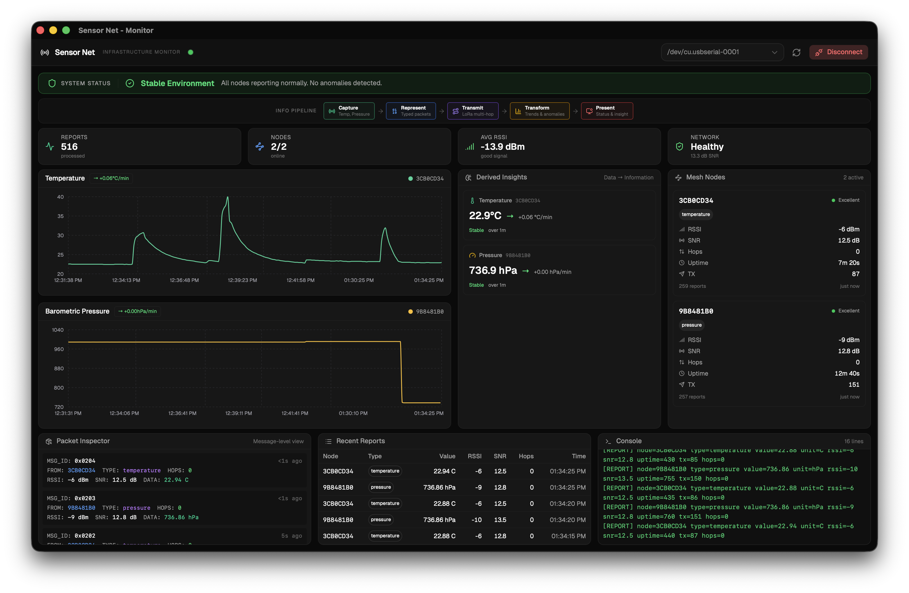
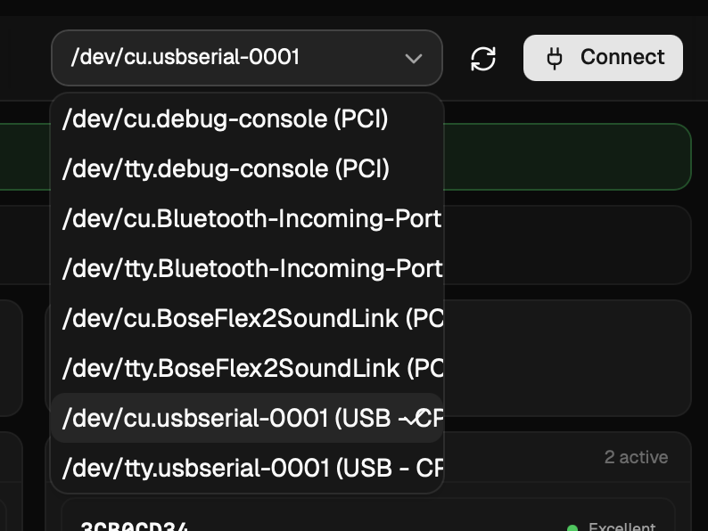

This page covers starting the monitor application in development mode, running just the frontend, and building a distributable binary.

## Development Mode

Development mode starts both the Vite dev server (for the React frontend with hot reload) and the Tauri native wrapper simultaneously:

```sh
bun run tauri dev
```

When you edit a frontend file (anything in `src/`), the UI updates instantly without restarting. When you edit a Rust file (anything in `src-tauri/src/`), the Rust backend recompiles and the app restarts automatically.

:::note
The first Rust compilation downloads and builds all Rust dependencies from source. This can take several minutes. Subsequent compilations are much faster because only changed code is recompiled.
:::



## Frontend Only Mode

If you only want to work on the UI layout and styling without needing the native Tauri shell, you can run just the Vite dev server:

```sh
bun run dev
```

Then open `http://localhost:1420` in your browser.

:::caution
In frontend-only mode, serial port access, SQLite database operations, and Tauri events are not available. The dashboard will not be able to connect to hardware or display real data. This mode is only useful for iterating on layout and styling.
:::

## Connecting to the Receiver

Once the app is running:

1. Plug the receiver node into your computer via USB.
2. In the top toolbar of the monitor application, click the **refresh button** (circular arrow icon) to scan for available serial ports.
3. Select the receiver's port from the dropdown. On macOS it appears as `/dev/tty.usbmodemXXXX`. On Windows it appears as `COM3` or similar.
4. Click **Connect**. The baud rate is fixed at 115200 to match the firmware.
5. The status indicator in the header turns green and begins pulsing when data is being received.
6. To stop reading data, click **Disconnect**.



## Building for Distribution

To compile a production binary for your operating system:

```sh
bun run tauri build
```

This performs three steps:

1. Compiles the TypeScript frontend into optimized static files.
2. Compiles the Rust backend in release mode (optimized, no debug symbols).
3. Bundles everything into a native application installer.

The output is placed in `src-tauri/target/release/bundle/`. The format depends on your OS:

| OS      | Output Format              |
| ------- | -------------------------- |
| macOS   | `.dmg` installer           |
| Windows | `.msi` or `.exe` installer |
| Linux   | `.deb` or `.AppImage`      |

:::note
The first full production build can take several minutes because Rust compiles all dependencies with optimizations enabled. Subsequent builds are faster.
:::

## Troubleshooting

| Problem                                   | Solution                                                                                                                                                                            |
| ----------------------------------------- | ----------------------------------------------------------------------------------------------------------------------------------------------------------------------------------- |
| `bun run tauri dev` fails to start        | Make sure Rust is installed (`rustc --version`). Check that Tauri system dependencies are installed for your OS.                                                                    |
| Serial port not appearing in the dropdown | Ensure the receiver node is connected via USB. Click the refresh button to rescan. On Linux, you may need to add your user to the `dialout` group: `sudo usermod -aG dialout $USER` |
| App starts but no data appears            | Make sure sensor nodes are powered on and within range of the receiver. Check that the receiver is printing `[REPORT]` lines in its serial output.                                  |
| Frontend hot reload not working           | Stop and restart `bun run tauri dev`. Make sure no other process is using port 1420.                                                                                                |

## Next Step

Learn how to read and use the dashboard in the [Dashboard Guide](/monitor/dashboard-guide/).
